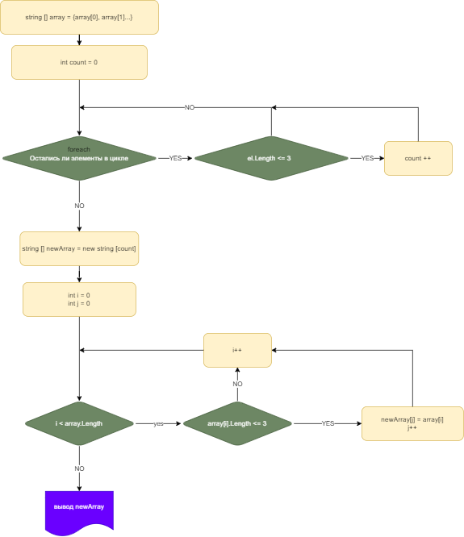

# First quarter test
##  My name is Alex

This is the first academic quarter test.
I am pretty sure it isn't interesting for you so you can go by.

So what's the deal

There is an array which consist of text elements
>string [] array = {"text","text"...}

My task is to make up a programm which check all the elements from this array and find which of them is equal or shorter than 3 symbols. 

Aftewards programm has to create new array which consist of elements was found in a previous step. 

To do list:
* Create remote repository
* Add README file
* Create flowchart
* Write code

Obviously during this journey I have to use GIT.

**As you can see I used GitHub :)**
<br>
<br>

##  **Here you can see the flowchart**


<br>
<br>


##  **Here I want to describe some methods I used** 
<br>


>This one prompts text value from user.
```
string PromptText(string message)
{
    Console.Write(message);
    string result = Console.ReadLine();
    return result;
}
```
<br>

>This one is almost the same. The difference is that this method prompts number.

```
int PromptNumber(string message)
{
    Console.Write(message);
    int result = Int32.Parse(Console.ReadLine()!);
    return result;
}
```
<br>

>This method return array with size which user inputed from terminal.

```
string[] CreateArray()
{
    int size = PromptNumber("Какого размера массив вы хотите создать: ");
    string[] array = new string[size];
    return array;
}
```
<br>

>This one allows to fill arrays elements by user from terminal
```
string[] FillArray(string[] array)
{
    for (int i = 0; i < array.Length; i++)
    {
        array[i] = PromptText($"Введите значение {i + 1} элемента: ");
    }
    return array;
}
```
<br>

>Method counts number of elements shorter than 4 symbols
```
int CountElementsShorterThanFour(string[] array)
{
    int count = 0;
    foreach (string el in array)
    {
        if (el.Length < 4)
        {
            count++;
        }
    }
    return count;
}
```
<br>

>Finally method which return new array with elements shorter than 4 symbols.
```
string[] RewriteArray(string[] array)
{
    string[] massif = new string[CountElementsShorterThanFour(array)];
    for (int i = 0, j = 0; i < array.Length; i++)
    {
        if (array[i].Length < 4)
        {
            massif[j] = array[i];
            j++;
        }
    }
    return massif;
}
```
<br>

>In order to see what is happening we need this method. It outputs arrays on terminal window.
```
void PrintArray(string[] array)
{
    Console.Write("Ваш массив: ");
    foreach (var item in array)
    {
        System.Console.Write($"{item}\t");
    }
}
```
<br>

## I suppose that is it :)
### Thank you a lot for your attention 
### Best of luck & see you 